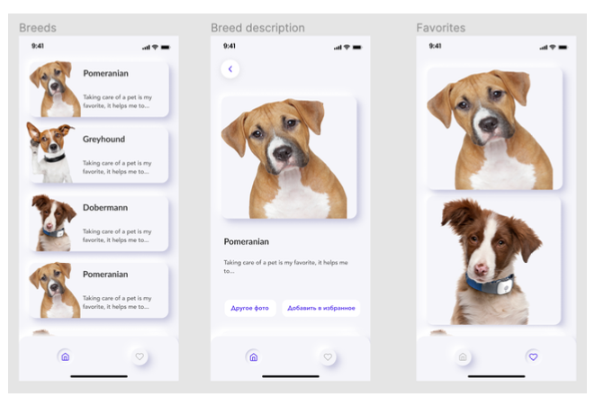

# YakovlevStudioTestProj
Test project for an interview on position React Native Developer

Общее количество времени: 10 часов
<ul>
  <li>1 - 2 часа: создание приложения на js</li>
  <li>3 часа: документация TypeScript и transition js/jsx => ts/tsx</li>
  <li>1 час: Проверки</li>
  <li>5 часов (ужас): пытаться сделать кнопки навигации как в примере Figma (см. ниже)
</ul>

# Alpha 1.0.1 staging
`Установка (можно любой из способов):`
<ol>
  <li>Заходим на <a href="https://expo.io/@denistepp/Cats-YakovlevStudio?release-channel=staging">Проект в Expo</a>. Сканим QR и смотрим приложение.</li>
  <li>Клонируем репу -> npm install -> expo start</li>
</ol>

`Что нового:`

`1.0.1`

Я добавил контекст приложения используя два метода (мне было очень интересно какая будет разница между hooks и redux). В итоге:

<ul>
<li>В приложении теперь есть контекст Redux который контролирует favourites картинки. Так же добавлены actions (удобно на самом деле) но я делал dispatch напрямую так как были простые типы данных</li>
<li>Так же, я добавил контекст другим способом: Context API из useReducer() и useContext() хуков</li>
<li>Картинки в FavouritesScreen загружается из redux контекста. Это можно легко поменять в рендере на state.favourites.</li>
<li>Функция удаления картинки из favourites пока еще не добавлена, но я планирую сделать или Swipeable или onLongPress() (не думаю что сложно так как action я уже сделал)</li>
<li>Так же есть функция рефреша - она синхронизирует данные из апи и переписывает контекст. Не знаю, real case это или нет, но я посчитал лишним выкидывать готовые методы апи из проекта.</li>
</ul>

Для себя я выделил что Redux неприхотлив только когда создаешь boilerplate. Как только основа готова, redux становится крутым инструментом в приложении.

Я бы поспорил что использование Redux нужно всегда, так как Context API решает (почти) все те же самые проблемы, но более легким путем. Нужно правильно расчитывать ресурсы и выделить для себя нужную архитектуру.

`Стек`:
<ol>
  <li>Typescript (90%) / Javascript (10%)</li>
  <li>Redux & useContext() + useReducer()</li>
  <li>Lottie</li>
  <li>React Navigation</li>
  <li>Expo</li>
</ol>

`Реализованные задачи:`
<ol>
  <li>Экран BreedsScreen для вывода всех пород</li>
  <li>Экран FavouritesScreen для вывода избранных пород</li>
  <li>Экран BreedScreen для вывода определенной породы (фото, название породы, описание)</li>
  <li>Экран BreedScreen для вывода определенной породы (фото, название породы, описание)
    <ol>
      <li> Функция "Другое Фото" которая загружает рандомное фото по определенной породе</li>
      <li> Функция "Добавить в Избранное" добавляет фото в избранные фото (api /favourites)</li>
    </ol>
  </li>
  <li>Lottie анимации (на загрузке методов и отдельных фото)</li>
</ol>

`Проверки:`
<ol>
  <li>Провека на наличие интернет-соединения</li>
  <li>Проверка на ответы API (result.ok)</li>
  <li>Проверка на пустые фотографии (может быть что нет image поля, а может быть есть image, но нет image.url => выводим дефолт)</li>
  <li>Проверка на пустой список "избранных" фото => выводим NoDataIndicator</li>
  <li>Проверка на добавление в избранное (если фото пустое)</li>
  <li>Проверка на существующее фото в избранных (если есть, то вывести сообщение пользователю)</li>
</ol>

`TODO:`
<ol>
  <li>Добавить Redux (по запросу / Context API не подойдет)</li>
  <li>Добавить проверки на "другое фото" (анимации, и state по обновлению фото)</li>
  <li>Удаление фото из избранных (но это не точно...)</li>
</ol>

`Вопросы (эта секция будет удалена в будущем):`
<ol>
  <li> Вопрос целесообразности API/favourites в данном приложении. Я понял это нужно для избранных фото: нажимаем "добавить в избранное" -> добавляем в контекст приложения (storage) -> выводим на экран в FavouritesScreen. Зачем тогда нам вызов апи для favourites если мы всех будем хранить локально? Только для рефреша (вызов всех favourites через GET)?

  В моем понимании был такой алгоритм:
  <ul>
    <li>Достать всех избранные фото из контекста (store)</li>
    <li>Загрузить на экран избранных фото</li>
    <li>Обновлять контекст когда пользователь нажимает "Добавить в избранное"</li>
  </ul>

  Я сделаю все равно и так (Redux) и так (api get), но хотелось бы понять саму суть данной задачи и как ПРАВИЛЬНО сделать в данном случае.
  <li>Я только начал писать на Typescript и возможно не соблюдаю common practices на данный момент, но у меня возникло пару вопросов насчет типов (хочется получить фидбек, если можно):
    <ul>
      <li>В приложении я почти все смог перевести на TS но все равно некоторые функции/файлы перевести не получилось из-за типов данных. Можете дать фидбек по поводу перехода на данный момент? На что стоит заострить внимание?</li>
      <li>Так же в приложении есть навигация (для них props очень замудренные, я все писал по документации или react ts cheatsheet): тут, если можно, получить добавочный фидбек. Есть ли какие-нибудь (более) простые способы добавлять ts в навигацию?</li>
    </ul>
  </li>
</ol>

# Дополнительно

## <a name="curious" href="https://cleancoders.com/episode/clean-code-episode-43">Как не надо тратить время, или тратить его с умом</a>
Пример Figma:

Обратите внимание на кнопки навигации (дом и сердце). Тут есть эффект "нажатия", в React Navigation это обычно используется с пропом `focused`, но эффект не совсем обычный...

Я потратил на разбор данного дизайна более 5 часов и так не(!) пришел к единому хорошему (быстрому и качественному) решению (если интересно: Боб Мартин, Clean Code, ep. 43: Productivity).

Вот мой разбор путей:

1. (Степень сложности - 0.1 из 100 ): Попробовать добавить shadow. Получилось для кнопки без фокуса. А как добавить inset shadow?
2. (Степень сложности - 4 из 100 ):  4 за 4 минуты после которых я понял что inset shadow вообще никак не встроен в ViewProps и React.CSSProperties. Ищем где можно использовать inset shadow.
3. (Степень сложности - 20 из 100): Пробуем xml svg от разных сторонних библиотек. Создаем кружок и накидываем shadow....все бы хорошо но css в svg на react native тоже не поддерживает inset!!!
4. (Степень сложности - 60 из 100 ): Переходим к более сложным и креативным (нет) путям. Я попробовал `expo-linear-gradient` и добился неплохого эффекта но все равно не получилось получить идеальный inset. Так же, рендер двух градиентов для разного фокуса - такое себе решение
5. (Степень сложности GIMP из GIMP): Создать две png картинки (эффект с нажатием и без). Я пользуюсь GIMP поэтому полез туда. После битых 1.5 часа я не смог сделать нормальную картинку и бросил это дело (нет). Кстати косяк с conditional rendering тут все равно остается, две картинки для кнопок навигации - не очень.
6. (Степень сложности - это реально?) После всех методов я так и не смог сделать такие же кнопки как на прототипе -> следовательно, не справился со своей задачей.

Я так много времени потратил на это, и теперь хочу знать, реально ли вообще сделать такой дизайн? Если да, то подскажите пожалуйста как это сделать или намекните на метод чтобы я смог хотя бы попробовать! Лично мне он понравился и я хотел бы его использовать его в последующих проектах.
